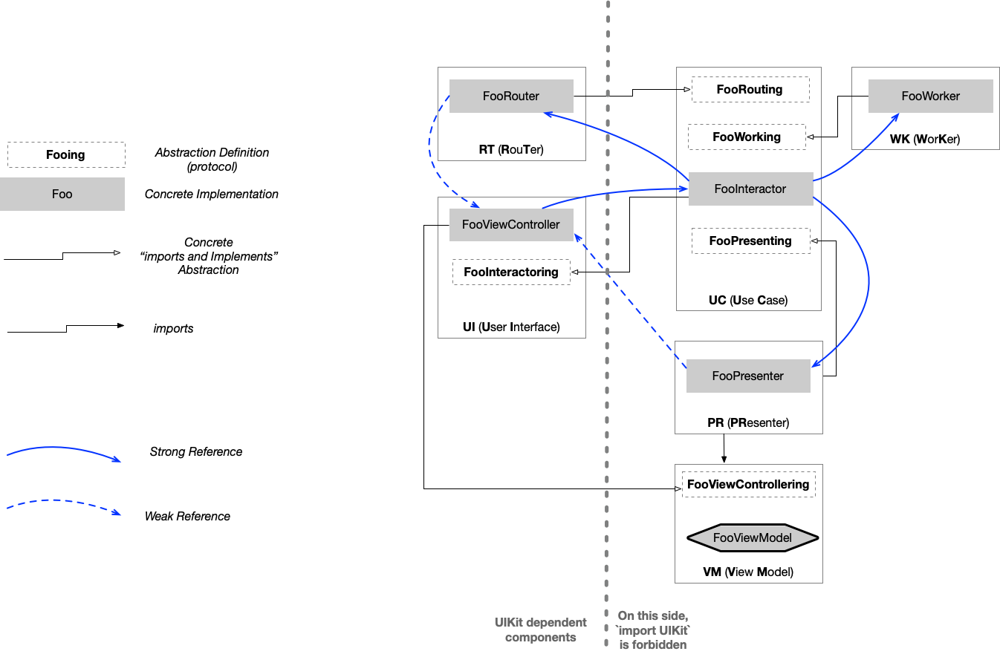

# LBC_Demo 
 Master/Detail Clean Architecture Demo App
 
## Architectural principles

### General principles (Clean Architecture)
1. **Dependency Injection** : Every dependencies are defined through abstractions (protocols), so components are lightly coupled and easy to fake while unit testing
2. **Dependency Inversion** : Service abstraction are defined on caller side. The concrete implementation component imports declaration. The abstraction -> concrete resolution is made by _Abstract Factory_ pattern
3. **Interface Segregation** : Common reusable services (like dataStore) are accesssed through distincts abstractions depending on what part of the service is really in use
4. **Single Responsibility** : Each Use Case of the app (each screen : master & detail) is decomposed in a chain of decoupled components with very restricted responsibility, inspired by _VIPER_ Approach (see below)

At Xcode project structure level, this result in many targets which can be built in isolation, greatly accelerating builds and unit tests execution (allowing quick and confortable _Test Driven Development_). Further more, The folder structure of each target is designed to easily externalizing the component in its own Swift Package (SPM).

### VIPER responsibility chaining
VIPER stands for View / Interactor / Presenter / Entity / Router.
Each Scene (ie: each use case screen) of the application is designed as collaboration network of these component.

* **View**
	These are user interface components. They don't have  any application logic or business logic responsability. Their only responsibilities are :
	* Receiving data to display from Presenter
	* Emiting user interaction to Interactor
  

* **Interactor**
	This is the Use Case (application logic) implementation place. Interactor receives user interaction request from View, retreives the  business data needed to build the user feedback response, gives the data to the presenter.

	
* **Presenter**
	Play the role of data aggregator between Interactor and View.
	Interactor gives business (entity related) data objects as input to the presenter. Presenter process and emits simple display  data to (mostly String and Enums) View. So that View are not coupled to to business or application logic, and so reusable in many use cases.

* **Entities**
	These are Business model objets, holding the business specific logic rules (different from application logic)

* **Router**
	Sometimes user interaction leads to changes the whole display scene (master->detail transition for ex). When such user request arrives from View to Interactor, the need to change the current Scene is detected by the Interactor but the responsibility of it is on the Router. Decoupling the user action from the navigation effect results in an application more flexible to navigation design changes and greatly simplify deeplinking.

  

